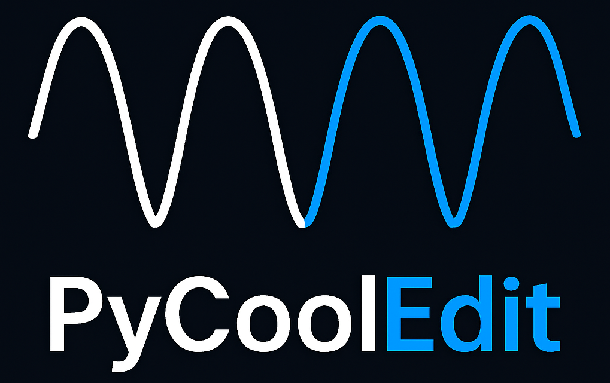
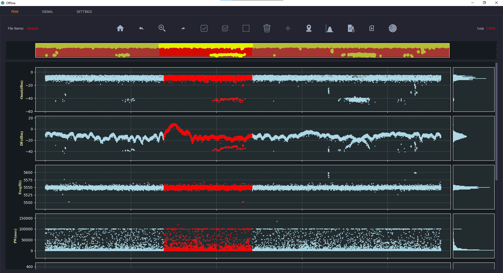
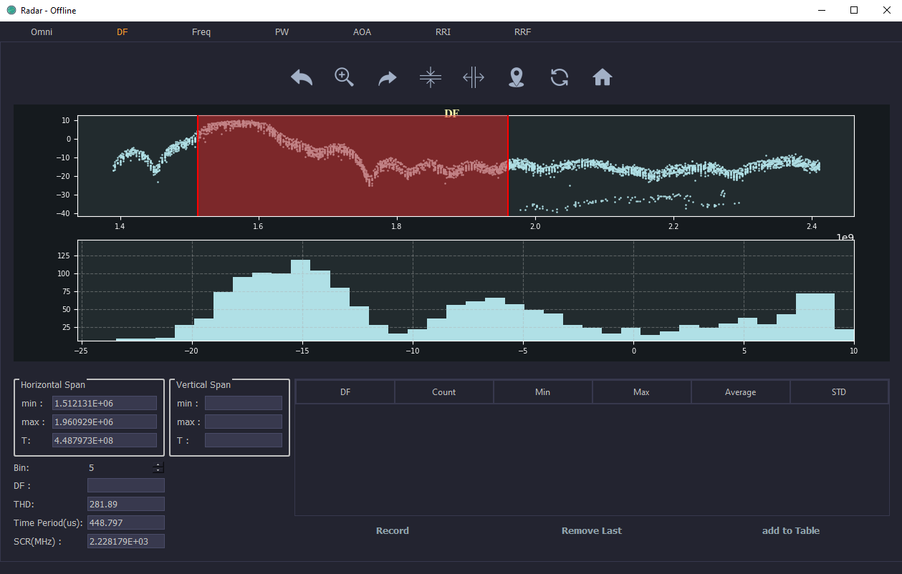
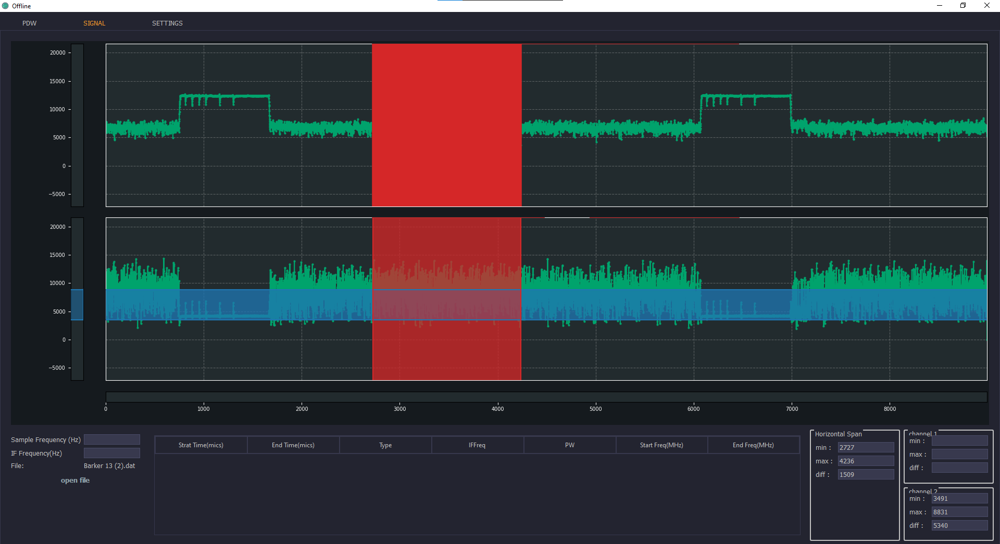

<p align="center">
  
</p>

<h1 align="center">🎛️ PyCoolEdit — Signal Visualization & Processing GUI</h1>

<p align="center">
  <a href="https://github.com/sepehrgh98/Chatbot">
    
  </a>
  <a href="https://colab.research.google.com/github/sepehrgh98/Chatbot">
    
  </a>
  <a href="https://opensource.org/licenses/MIT">
    
  </a>
</p>


<p align="center">
  A modern PyQt-based reimplementation of <strong>CoolEdit</strong> for signal and waveform processing.
</p>


## 🎯 Project Goals

- ✅ Recreate the core functionalities of **CoolEdit** using Python & PyQt
- 🎨 Build an intuitive, responsive, and modular GUI for signal interaction
- ⚙️ Provide a base for further **audio/signal editing** extensions


## ✨ Key Features

#### 🧩 Two Processing Modes

##### 1. Offline Mode — PDW Data Processing
- Load and visualize **multi-channel PDW signal data**
- Display full signal overview per channel, along with their **histograms**
- Interactive tools to:
  - Select specific segments
  - Apply statistical analyses (mean, variance, peak detection, etc.)
  - Remove or normalize selected regions
  - Save selections to file
  - Span, zoom, and navigate long signals
- Tailored for **batch-style, offline analysis**

##### 2. 🎧 Signal Mode — Continuous Signal Exploration
- Designed for **long mono or stereo recordings**
- Inspired by **CoolEdit**, with full editing interactivity
- Supports:
  - **Online zooming**, real-time scrolling
  - Interactive **region selection**
  - **Statistical signal analysis**
  - Span, cut, normalize, and navigate seamlessly

#### 📂 File Support  
  - Load `.wav`, `.csv`, `.mat` files  
#### 🖱️ GUI Interactivity  
  - Zoom, pan, select, span, scroll  
#### 💡 Built in **Qt Designer**, implemented with `PyQt5`

## 🚀 Getting Started

### 📦 Installation

```bash
git clone https://github.com/your-username/PyCoolEdit.git
cd PyCoolEdit
pip install -r requirements.txt
python main.py
```

## 🧪 Requirements
- Python 3.7+
- PyQt5
- numpy
- matplotlib 3.6.3


## 🧠 Use Cases

- Teaching digital signal processing (DSP) principles

- Visualizing PDW or audio waveforms for research

- Performing exploratory data analysis on recorded signals

- Developing interactive DSP apps based on PyQt

- A lightweight open-source alternative to legacy tools like CoolEdit

## 🧩 Project Structure


```bash
PyCoolEdit/ 
├── main.py # Entry point to launch the application 
├── visualization
│   ├── GUI  # All GUI components used in this project
│   ├── pdw  # Offline mode 
│   ├── Radar # Offline mode analysis
│   ├── Signal # Signla mode
├── requirements.txt
├── README.md
```

## 🖼️ Screenshots

### 🔍 Offline Mode – PDW Signal Analysis

<p align="center">  </p>

### 📊 Histogram & Statistical Tools

<p align="center">  </p>

### 🎧 Signal Mode – Long Signal Interaction

<p align="center">  </p>

## 📜 License

This project is licensed under the **MIT License**.  
See [LICENSE](LICENSE) for full terms.


## 🙌 Acknowledgements
- Thanks to the original CoolEdit team for setting the foundation and Amirkabir University of Technology for providing this chance.

- Built using Python, PyQt, NumPy, SciPy, and Matplotlib

- Community-driven: Contributions and suggestions are welcome

## 📬 Contact

If you have any questions or feedback, feel free to contact us at:

📧 sepehrghamri@gmail.com


